# Broadleaf Development Setup Guide
The Broadleaf installation has the following steps:
1. Install Java 8.0
2. Install Maven
3. Download Broadleaf
4. Install Spring Tool Suite(STS)
5. Import and Build Broadleaf DemoSite
6. Switch to MySQL
7. Start the Demo Site
8. Import and Build Broadleaf Core

## 1. Install Java 8.0
1.	Download the Java file.
`jdk-8uversion-macosx-x64.dmg` from Oracle Java website.
Before the file can be downloaded, you must accept the license agreement.
2.	From either the Downloads window of the browser, or from the file browser, double click the .dmg file to launch it.
A Finder window appears containing an icon of an open box and the name of the .pkg file.
3.	Double click the package icon to launch the Install app.
The Install app displays the Introduction window.
4.	Click Continue.
The Installation Type window appears.
5.	Click Install.
A window appears that says "Installer is trying to install new software. Type your password to allow this."
6.	Enter the Administrator login and password and click Install Software.
The software is installed and a confirmation window appears.
7.	After the software is installed, delete the .dmg file if you want to save disk space.
8.	Configure the path, In terminal :
```bash
$ cd ~
$ touch .bash_profile
$ vi .bash_profile
```
Add the following conents to the .bash_profile:

```bash
export JAVA_HOME='/Library/Java/JavaVirtualMachines/jdk1.8.0_92.jdk/Contents/Home'
export CLASSPATH=.:$JAVA_HOME/lib:$JAVA_HOME
export PATH=$PATH:$JAVA_HOME/bin:$JAVA_HOME/jre/bin
```

Test your Java installation:
```bash
$ source .bash_profile
$ java –version
```
You should see something like the following:
> java version "1.8.0_92"

> Java(TM) SE Runtime Environment (build 1.8.0_92-b14)

> Java HotSpot(TM) 64-Bit Server VM (build 25.92-b14, mixed mode)

## 2. Install Maven
1.	download the maven file
`apache-maven-3.3.9-bin.tar.gz` from Apache Maven site  https://maven.apache.org/download.cgi
2.	extract `apache-maven-3.3.9-bin.tar.gz` to directories ,for example : ``/Users/MyUsername/apache-maven-3.3.9`
3.	open terminal ,set maven path in `~/.bash_profile`
> export M2_HOME=/Users/MyUsername/apache-maven-3.3.9
> export PATH=$PATH:$M2_HOME/bin

Verify the installation:
```bash
$ source ~/.bash_profile
$ mvn –v
```

## 3. Download Broadleaf
Broadleaf changed its license after version 5.0. Therefore we use version 4.0.5-GA.
1. Download Broadleaf core source code and unzip it to your project folder. https://github.com/BroadleafCommerce/BroadleafCommerce/releases/tag/broadleaf-4.0.5-GA
2. Download Broadleaf demo site source code and unzip it to your project folder. https://github.com/BroadleafCommerce/DemoSite/releases/tag/broadleaf-4.0.5-GA

## 4. Install Spring Tool Suite (STS)
Download and install Spring Tool Suite from https://spring.io/tools.

## 5. Import and Build Broadleaf
### 5.1. Preparation
1. Create a new directory and start STS using the newly created directory as its workspace directory.
2. Unzip the two Broadleaf project files into the workspace directory.

### 5.2. Import DemoSite-broadleaf-4.0.5-GA

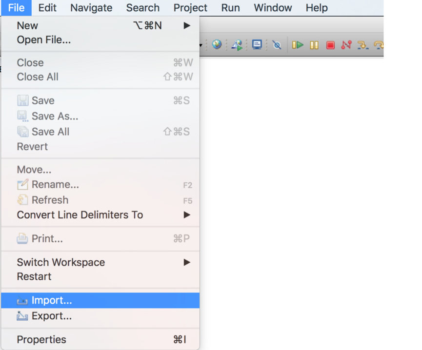

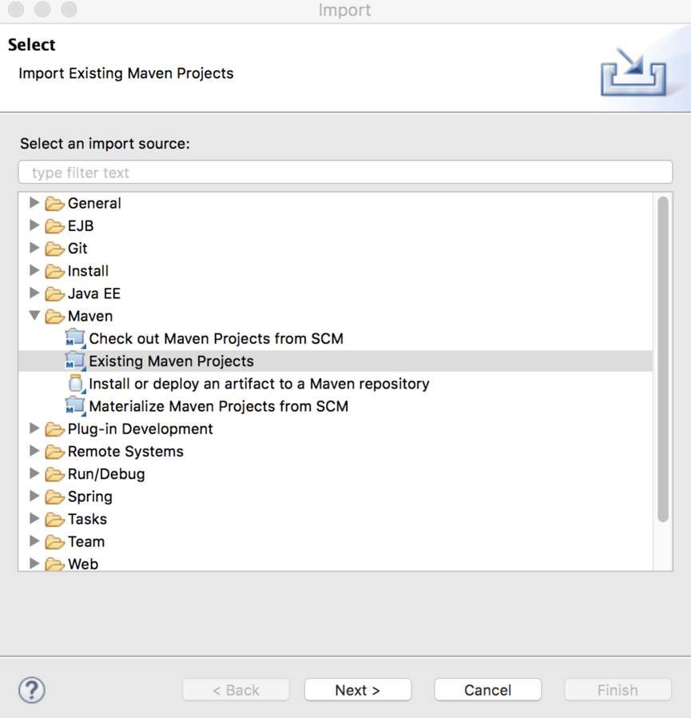

click next and in the box for "Root Directory" enter the path to the
directory that you saved your DemoSite-broadleaf-4.0.5-GA to on
your filesystem, or hit the "Browse..." button next to the input box to
browse for the location. After you do that, you should now see 4 different
projects pop up:

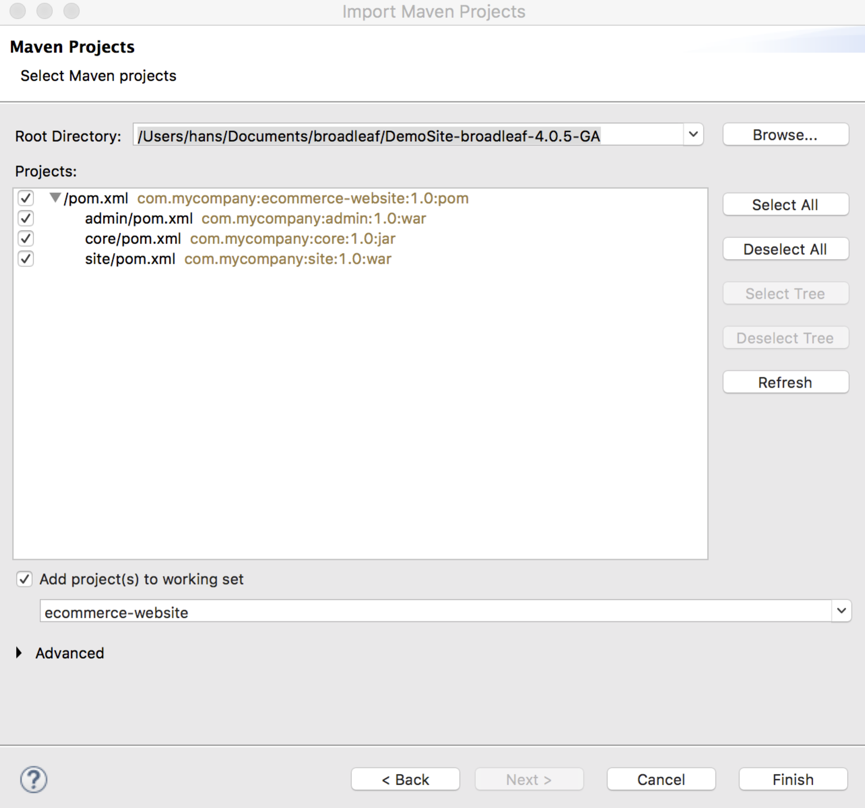

Note that there is a checkbox for "Add project(s) to working set" and the value is defaulted to `ecommerce-website`. Working sets will become important later, we just use the default for now. Click finish button. It might take a bit to complete as sts downloads all of the Maven dependencies necessary for Broadleaf. If you cloned the project from GitHub, you might also see an 'Auto share git projects' dialog box as well.

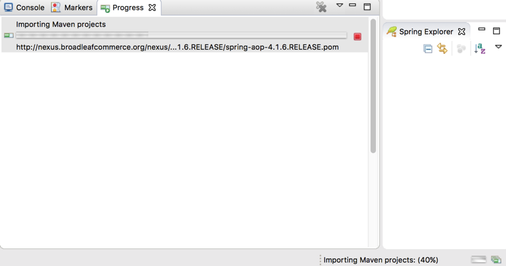

Once the import process is done, your workspace looks like the following:

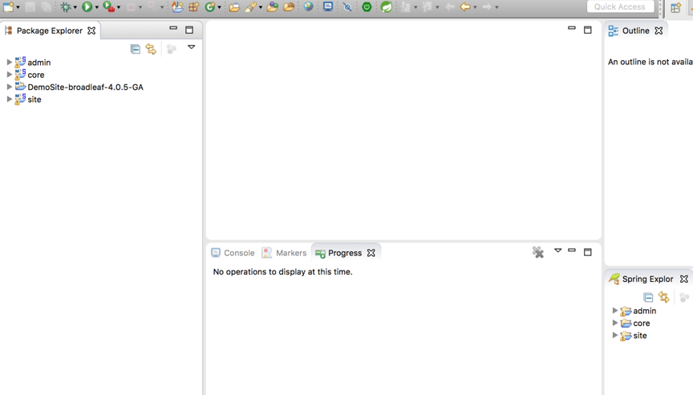

You should have 4 projects in your installation:
1.	DemoSite-broadleaf-4.0.5-GA - the "Maven parent" that the other projects are children of. This is not a Java project on a Java build path.
2.	admin - the Broadleaf backend application for managing the catalog, content, offers, etc. Builds into a `.war` file.
3.	core - common module shared between the site and admin projects, used for common utilities, services, database tables, etc
4.	site - the demosite frontend. Contains all of the styling and user interactions  

### 5.3. Build DemoSite-broadleaf-4.0.5-GA
Now that the project is imported, right-click on the root project (DemoSite-broadleaf-4.0.5-GA) and go to Runas -> Maven -> Install

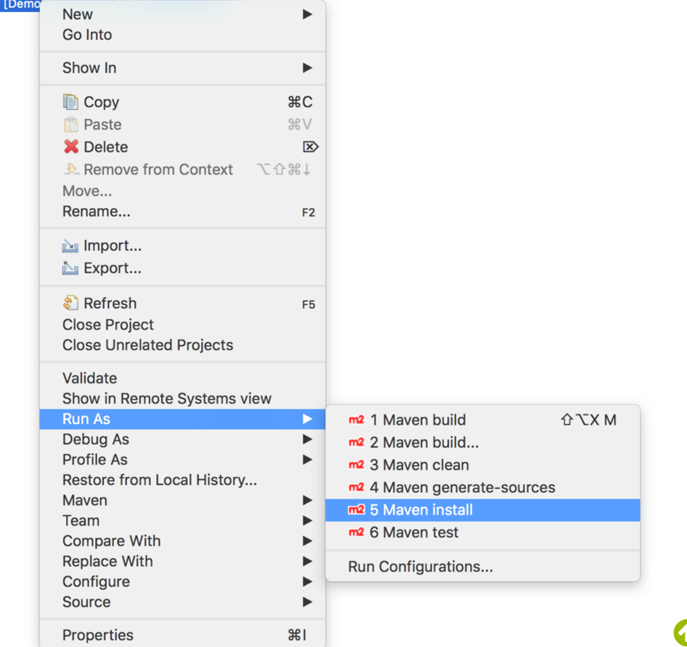

this will fully compile and build the demosite application. Once this is completed, you have four successful builds:

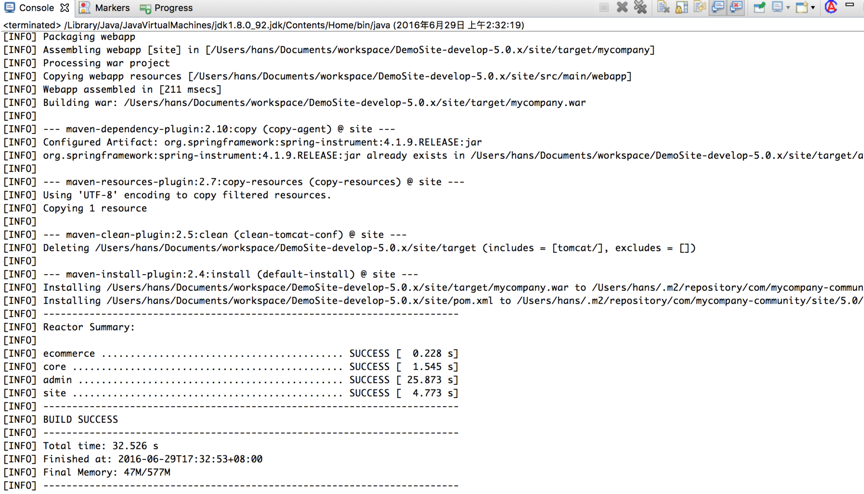

### 5.4. Select the Working Set View
First, From the `view menu` dropdown list, click `Select Working Set...`

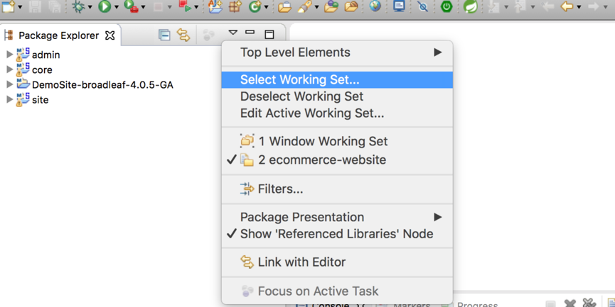

Then select `ecommerce-demosite` working set.

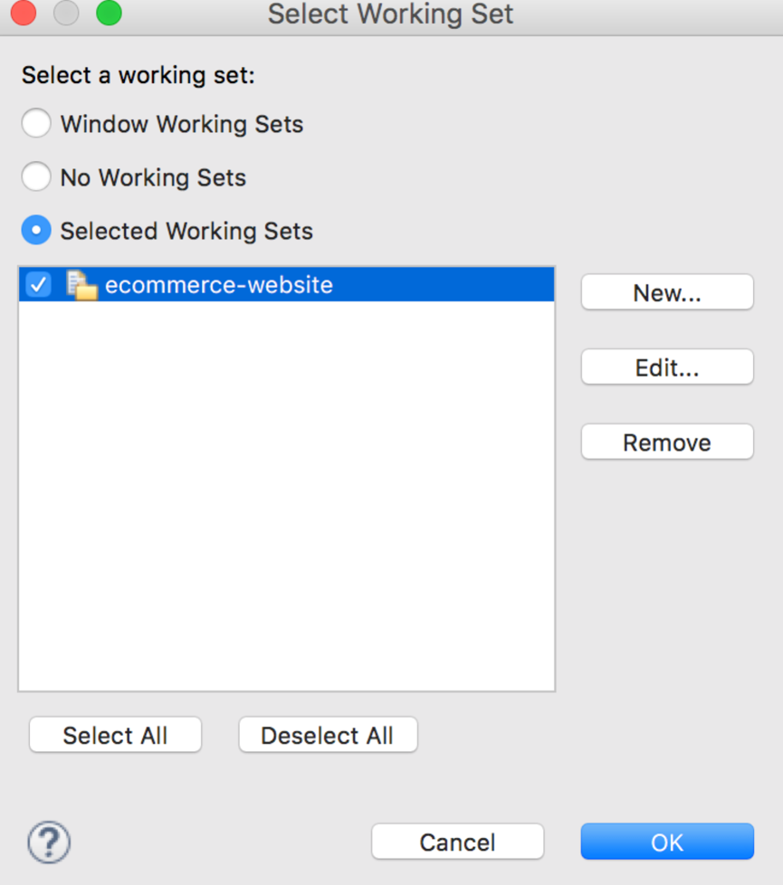

Then on top level Elements ,select `Working Sets`.

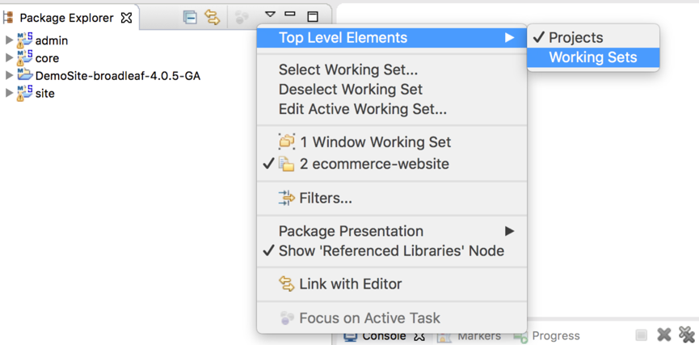

The next step is to configure the working set.

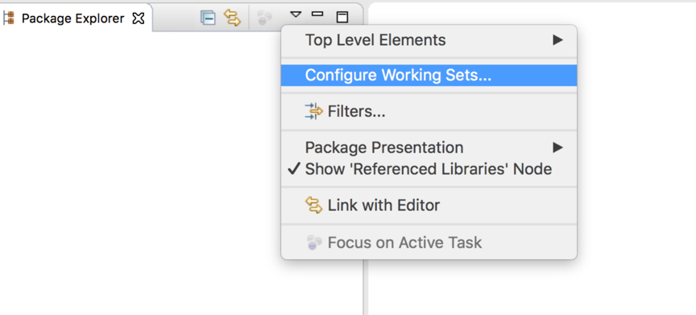

Select the `ecommerce-demosite` working set and click `OK`

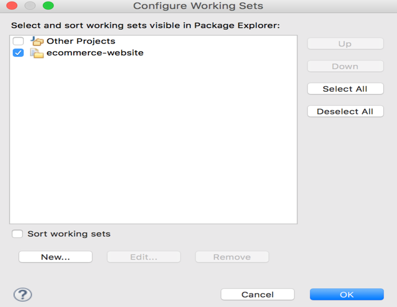

Now the `Package Explorer` should look like the following:

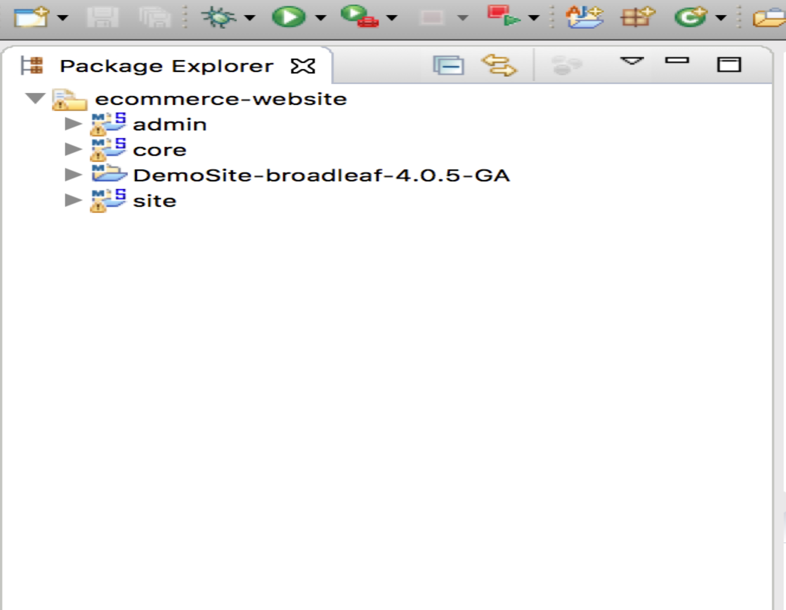

### 5.5. Add Ant Build Tasks
First, add an ant build view.

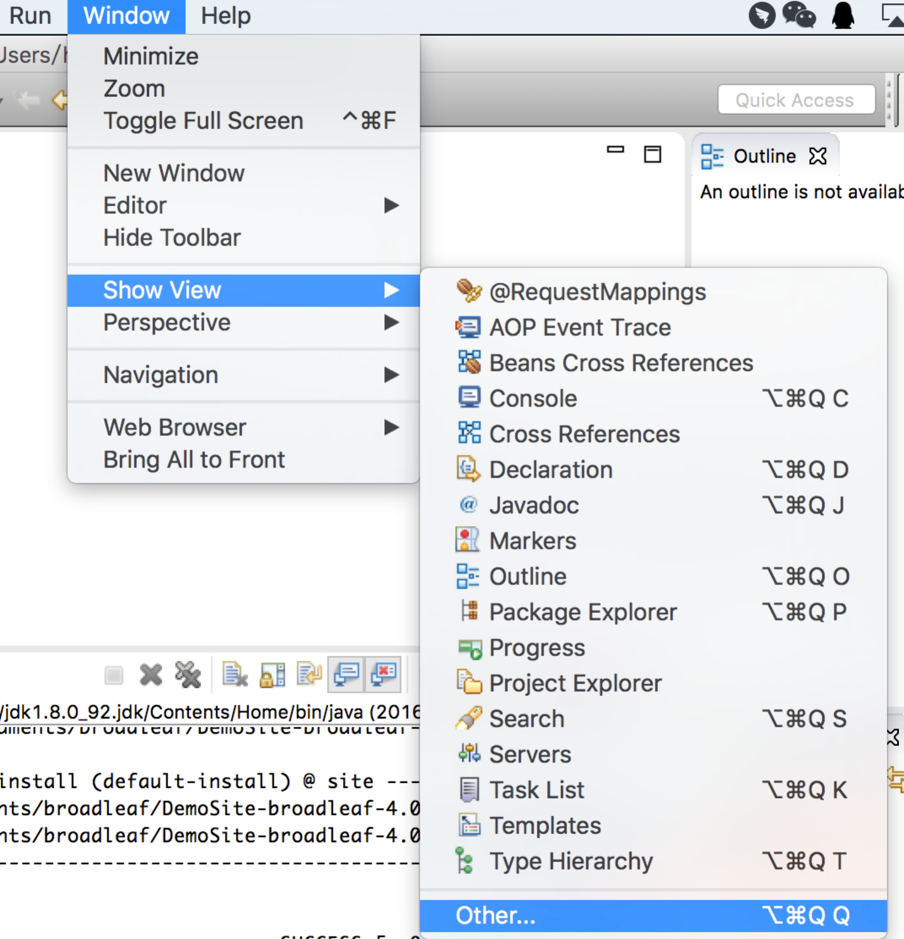

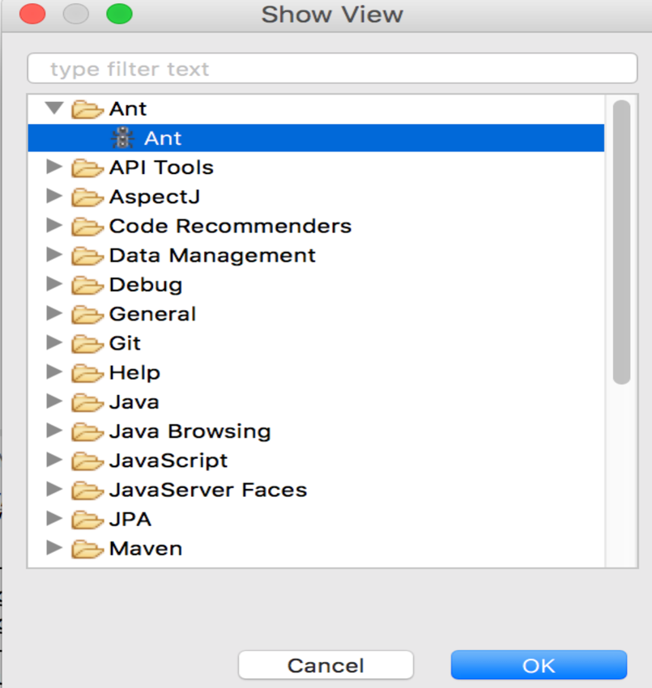

Then, in the newly added `Ant` view, click "Add Buildfiles" on the top right menu bar. Add `build.xml` files from `admin` and `site` projects.

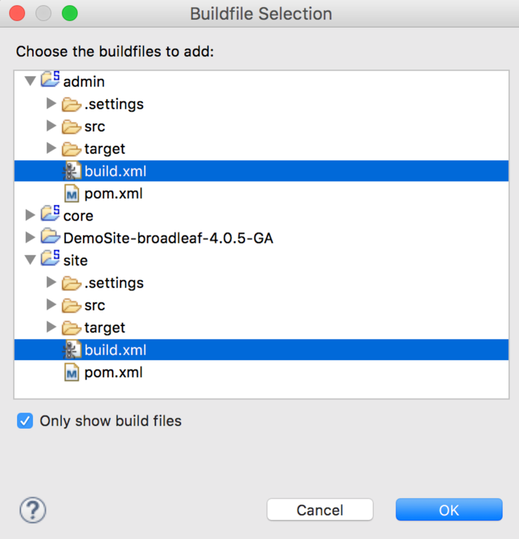

Now the Ant view looks like below:

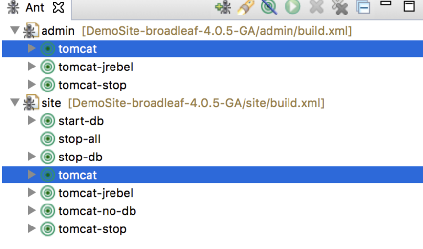

In `DemoSite-broadleaf-4.0.5-GA` project, open `build.properties` file and configure the `mave.home` to your Maven installation root. An example is as the following:

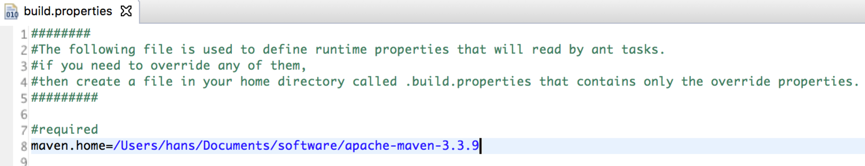

## 6. Switch to MySQL
A very common step that users may want to do is switch away from the bundled HSQL database to a more mature database such as MySQL. Download and install MySQL Database (http://dev.mysql.com/downloads/mysql/)

### 6.1. MySql Settings
For proper UTF8 configuration and easy of use across multiple platforms (Linux, MySQL, Windows) we also recommend these minimum settings in my.cnf:

> [mysqld]

> lower_case_table_names=1

> character-set-server=utf8

> collation-server=utf8_general_ci

### 6.2. Create database

Create a new database named broadleaf and a user capable of accessing this database with privileges for creating tables.
```sql
CREATE DATABASE IF NOT EXISTS broadleaf DEFAULT CHARSET utf8 COLLATE utf8_general_ci;
```

### 6.3. Use MySQL
In your root `pom.xml`, find the following in the `<dependencies>` section under the `<plugin>` with `<groupId>org.apache.tomcat.maven</groupId>`

```xml
<dependency>     
    <groupId>org.hsqldb</groupId>    
    <artifactId>hsqldb</artifactId>     
    <version>2.3.1</version>     
    <type>jar</type>     
    <scope>compile</scope>
</dependency>
```

and replace it with

```xml
<dependency>     
  <groupId>mysql</groupId>
  <artifactId>mysql-connector-java</artifactId>        
  <version>5.1.26</version>
</dependency>
```

### 6.4. Config MySql dialect
In `core/src/main/resources/runtime-properties/common-shared.properties`, you need to update the three persistence unit dialects:

>blPU.hibernate.dialect=org.hibernate.dialect.MySQL5InnoDBDialect

>blSecurePU.hibernate.dialect=org.hibernate.dialect.MySQL5InnoDBDialect

>blCMSStorage.hibernate.dialect=org.hibernate.dialect.MySQL5InnoDBDialect

### 6.5. Use MySql Database
In build.properties, you have the following setup:

> \# your local database username, just a user that has readwrite permissions

>database.user=root

> \# local database password

>database.password= database.driver=com.mysql.jdbc.Driver

> \# this connection URL assumes that it is connecting to a schema called broadleaf

>database.url=jdbc:mysql://localhost:3306/broadleaf?useUnicode=true&amp;characterEncoding=utf8

Note: `database.driver` and `database.url` have been changed from HSQLDB to MySQL.
Here the database name is `broadleaf`, make sure you use your database name in the url.

### 6.6. Remove the HSQL dependency
Remove the HSQL dependency from the site ant targets. In your `site/build.xml` file replace

```xml
<target name="tomcat" depends="start-db">
```

with
```xml
<target name="tomcat">
```
and replace
```xml
<target name="tomcat-jrebel" depends="start-db">
```
with
```xml
<target name="tomcat-jrebel">
```
And that's it! You should now be up and running with MySQL.

## 7. Start the Demo Site
This is the easiest part.
### 7.1. Start the client
Start the client front end by clicking site `tomcat` ant task.
Once this has finished executing, you should be able to see it by going to http://localhost:8080 in your browser.

### 7.2. Start the Admin
Start the admin front end by clicking admin `tomcat` ant task
Once this has finished, load the admin by going to http://localhost:8081/admin in your browser. The username/password is admin/admin

## 8. Import and Build Broadleaf Core

### 8.1. Import and Build Broadleaf core
Similar to import and build the demo site, import and build `BroadleafCommerce-broadleaf-4.0.5-GA`. When it is done, we have the following view:

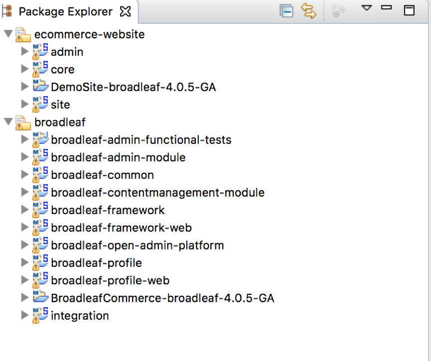

### 8.2. Configure Remote Debug
In debug Configurations window, new-> java remote application.

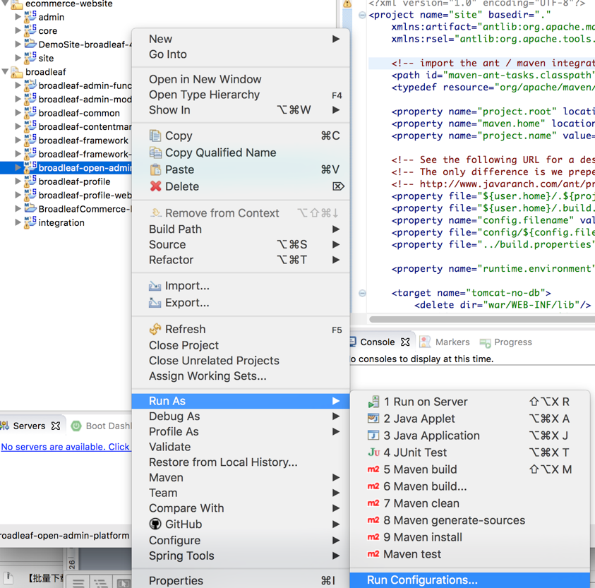

In debug Configurations window, new-> java remote application

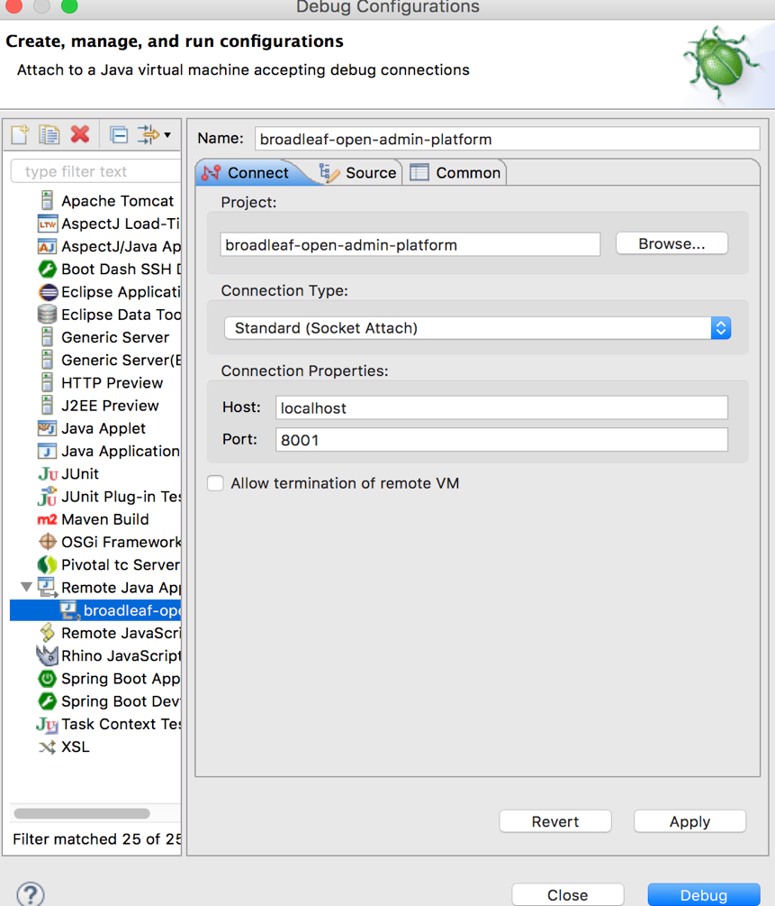

start `demosite/admin tomcat`, then debug `broadleaf-open-admin-platform`, when start , open `broadleaf-open-admin-platform` source code: `AdminBasicEntityController` ,find `viewAddEntityForm` function,in first fine code ,add breakpoint:

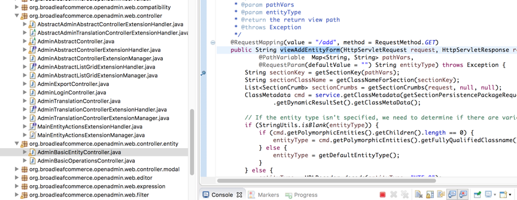

Open http://localhost:8081/admin ,login ,open category page, click “Add Category “ button ,then

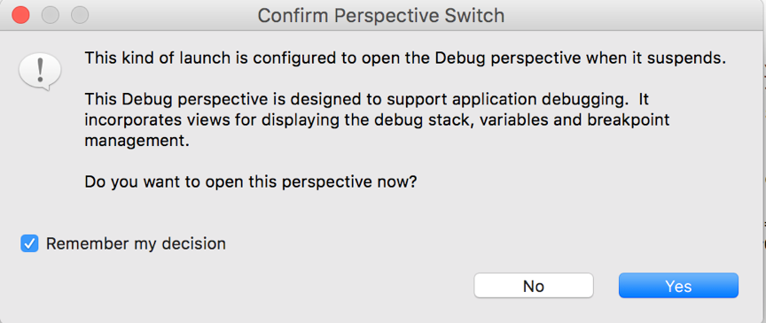

click “Yes”, you can debug source code now. 

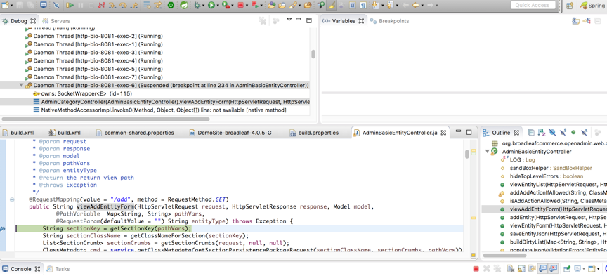
